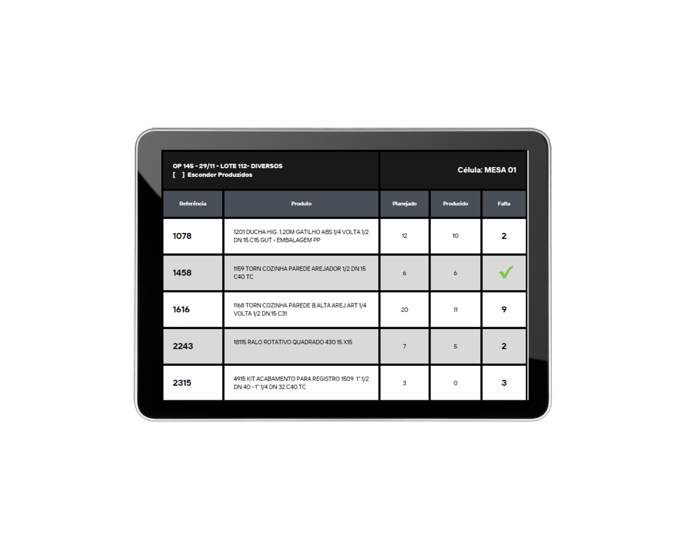
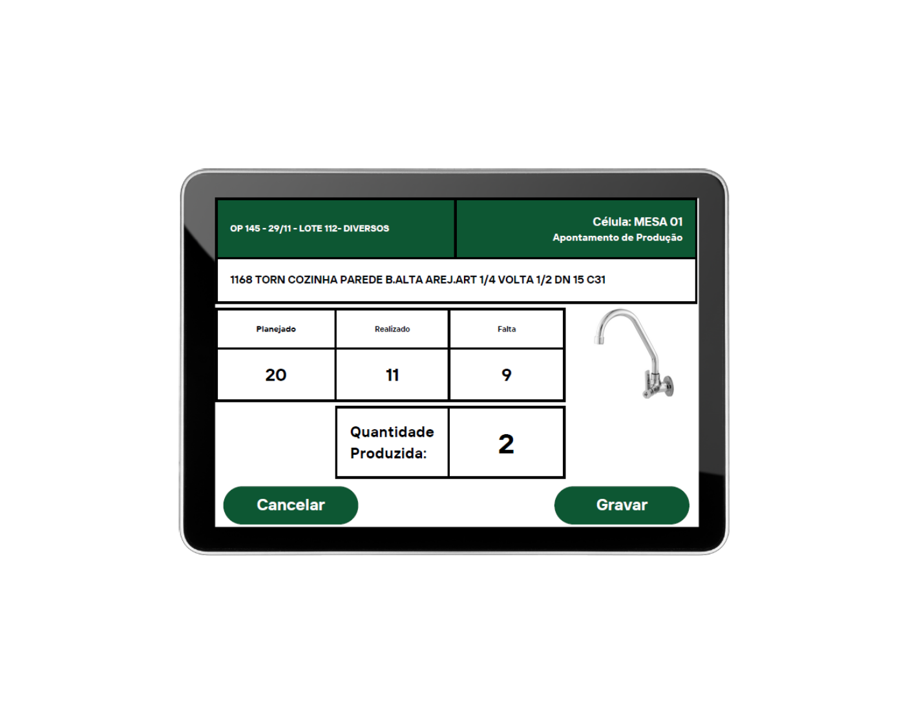

# 📱 Adaptação de Interface: Tablet para Smartphone

Projeto acadêmico desenvolvido durante meus estudos de Análise e Desenvolvimento de Sistemas (ADS), utilizando o Pencil para prototipação de interfaces.

## 🎯 Objetivo do exercício

O desafio proposto foi adaptar uma interface originalmente desenvolvida para **tablet** para uma versão destinada a **smartphone**.

A adaptação deveria preservar as principais informações, funcionalidades e o padrão visual da interface original, reorganizando os elementos para o espaço reduzido da tela de um smartphone.

## 🖥️ Interface original — Tablet

As imagens abaixo foram fornecidas como referência para realização do exercício.

### Tela 01 — Controle de Produção

### Tela 02 — Apontamento de Produção

## 📱 Minha adaptação — Smartphone

A partir das referências para tablet, desenvolvi no Pencil uma versão adaptada para smartphone.

Foram mantidas informações importantes do sistema, como:

- Referência e descrição dos produtos
- Quantidade planejada
- Quantidade produzida/realizada
- Quantidade faltante
- Apontamento da quantidade produzida
- Ações de cancelar e gravar

📄 **O resultado da adaptação está disponível no arquivo `Tela 01 e Tela 02.pdf` deste repositório.**

## 🛠️ Ferramenta utilizada

- Pencil Project

## 📚 Aprendizado

Com este exercício pratiquei conceitos de:

- Prototipação de interfaces
- Adaptação de layout para diferentes tamanhos de tela
- Organização de informações em espaços reduzidos
- Manutenção de padrões visuais entre diferentes dispositivos

## 👨‍💻 Autor

**Rafael Camilo**

Estudante de Análise e Desenvolvimento de Sistemas.
